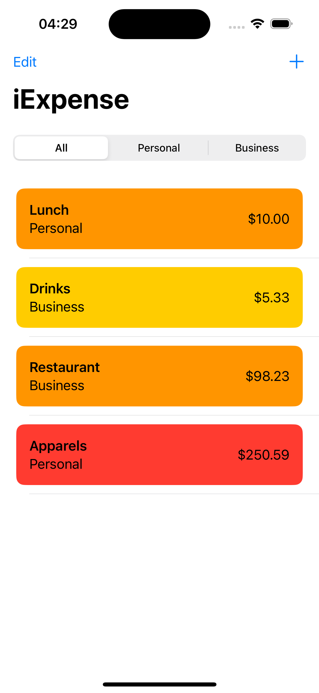
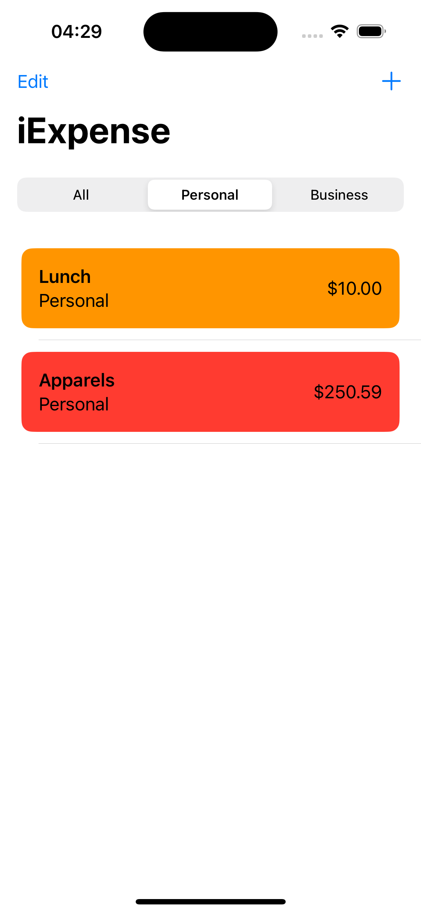
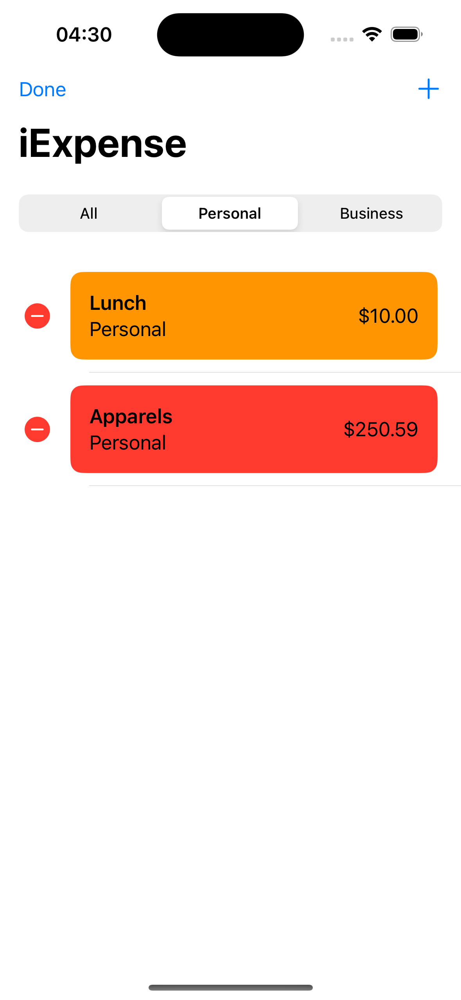
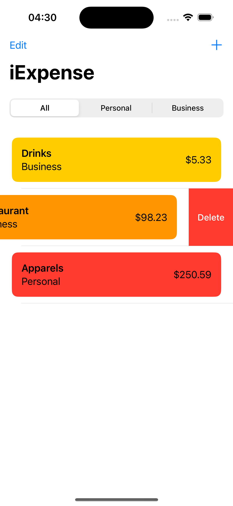
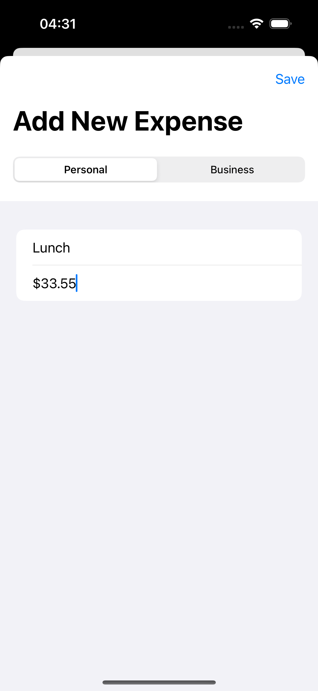

# iExpense

## Description
iExpense is a simple expense tracking app built with SwiftUI. Designed for 100DaysOfSwiftUI

## Features
- Add new expenses with name, amount, and type (Personal or Business)
- View and delete existing expenses
- Filter expenses by type

## Installation
Clone the repository and open the project in Xcode.

## Requirements
- Xcode 13.x or later
- Swift 5.5 or later
- macOS 12.x or later

## How to Use
1. Launch the app.
2. Tap on "Add Expense" to add a new expense.
3. Enter the expense details - name, amount, and type.
4. Tap "Save" to add the expense.
5. Swipe left on an expense to delete it.
6. Use the segmented control at the top to filter expenses by type.

## Screenshots

## Credits
- **Developer:** Om Preetham Bandi
- **Framework:** SwiftUI

## License
This project is licensed under [LICENSE](LICENSE)
